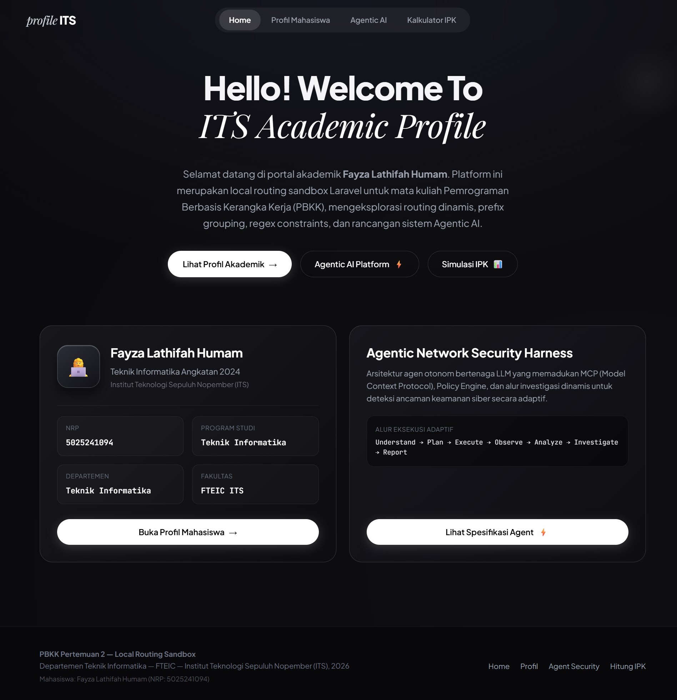

# PBKK Pertemuan 2 — Local Routing Sandbox Laravel

Aplikasi profil akademis statis berbasis Laravel yang berfokus pada penguasaan instalasi proyek, routing dasar, parameter wajib & opsional, regex constraints, named routes, route grouping ber-prefix, dan fallback route.

Dibuat untuk memenuhi tugas mandiri mata kuliah **Pemrograman Berbasis Kerangka Kerja (PBKK)** — Departemen Teknik Informatika, FTEIC, Institut Teknologi Sepuluh Nopember (ITS) Surabaya.

---

## Identitas Mahasiswa
- **Nama:** Fayza Lathifah Humam
- **NRP:** 5025241094
- **Program Studi:** Teknik Informatika
- **Departemen:** Teknik Informatika — Fakultas Teknologi Elektro dan Informatika Cerdas (FTEIC)
- **Angkatan:** 2024

---

## Struktur Routing & Grouping (`routes/web.php`)

Seluruh rute profil akademis dibungkus ke dalam **satu grup ber-prefix `dashboard`** menggunakan `Route::prefix('dashboard')->group(...)`, sehingga seluruh URL otomatis diawali dengan `/dashboard/...`:

| Method | Rute | Nama Rute | View Blade | Keterangan |
|---|---|---|---|---|
| `GET` | `/` | `home` | `home.blade.php` | Beranda utama dengan sambutan khas ITS & ringkasan profil. |
| `GET` | `/dashboard/mahasiswa/{nrp}` | `mahasiswa.profil` | `mahasiswa.blade.php` | Detail profil mahasiswa & 7 mata kuliah semester ini dengan **regex constraint 10 digit angka** (`->where('nrp', '[0-9]{10}')`). Non-10 digit menghasilkan 404. |
| `GET` | `/dashboard/agent/{tema?}` | `agent.ide` | `agent.blade.php` | Konsep platform AI (*Agentic Network Security Harness*). Parameter opsional dengan default `"General Assistant Agent"`. |
| `GET` | `/dashboard/hitung-ipk/{ipk1}/{ipk2}` | `ipk.hitung` | `ipk.blade.php` | Kalkulator IPK otomatis dengan validasi desimal, perhitungan rata-rata, dan validasi rentang (0.00 – 4.00). |
| `ANY` | `{fallback}` | — | `errors/fallback.blade.php` | Menangani seluruh URL yang tidak terdaftar dengan status HTTP 404. |

Screenshots

